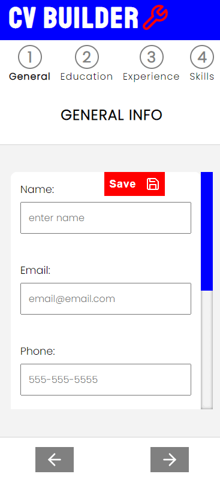

# CV Builder

- [Description](#description)
  - [Built With](#Built With)
  - [Screenshots](#screenshots)
  - [Links](#links)
- [My process](#my-process)
  - [Challenges](#challenges)
  - [Installation Instructions](#installation)
- [Author](#author)

## Description

The CV Builder App is a Single Page Application that allows a user to enter details and create a printable/downloable formatted resume.  This app utilizes a multi-step form to input user information, a custom progress bar to indicate which step the user is in the process, and local storage to save the information until a user chooses to clear the data.  This app solves the problem of not knowing how to format a resume, as well as not knowing what information should be included in a resume.

### Built With
- React
- Styled Components
- React-To-Print
- Local Storage

### Screenshots

### Links

- Live Site URL: [https://artsycoder533.github.io/CV-Builder/](https://artsycoder533.github.io/CV-Builder/)
- Repository URL: [https://github.com/artsycoder533/CV-Builder.git](https://github.com/artsycoder533/CV-Builder.git)

## My Process

To start this project, I made a list of the parts of a typical CV and organized them into sections such as General Information, Education, Experience and Skills.  Once I had these sorted lists I then made a quick sketch of how I wanted the UI to look.  I came to the conclusion that it would be better to utilize a multi=step form rather than having one long form to fill out.  I figured that this way, it would not overwhelm the user.  I also decided I wanted a progress bar at the top so the user would know how close they were to completing all the steps.  Before I started coding, I thought about what variables I would need to hold in the state for each section along with what functions each section might need.  To implement the multi-step form, I would utilize a state variable called view, that would be used to conditionally render the UI based on the value of the view.  Once I started coding, I worked on the UI for each section at a time.  Once the UI was complete I then added event handlers and other functionality.  Once the basic functionality was complete, I then styled the UI using Styled Components.  After that I kept adding features such as form validation, local storage, custom scrollbar, progress bar functionality, and a control variable to handle enabling/disabling the buttons if the user has not successfully entered valid input in each field.  Along the way I added notes regarding challenges I faced, etc. to refresh my memory to aid in writing this readme.

### Challenges I faced while building this project

- **Problem**: How to handle the state of multiple inputs inside a single form?
- **Solution**:  I utilized the name attribute for all inputs and used bracket notation to dynamically create and match the name of the event with the value in the onChange event handler.

- **Problem**: How to only validate current form entry?
- **Solution**:  I added a state variable called currentEntry that represented the index of the entry the user has just typed in in.  Once the user presses the Save button, the index of that entry is passed as a parameter to the onSubmit event handler.  Inside the onSubmit event hander is a function call to the validate method.  The index is also passed to the validate method which tells the function which entry to check for validation.  In the render function, the currentEntry state variable is compared against the index of the entry.  If a match, only that entry will display error messages under the input fields.

- **Problem**:  How to handle dynamic radio buttons with the same name attribute?
- **Solution**:  Since radio buttons that have the same name attribute all belong to the same group.  When I had duplicate entries, its only allowed one set of radio buttons to be selected.  To fix this, I used a template string for the name attribute and appended the index after the actual name attribute, so that each set of radio buttons would belong to their own group.  In the onChange function, I set a conditional so that if the event type is radio, the original name attribute is set to the value, which allows each individual entry forms radio buttons to all be selected.

### Installation Instructions
To run the project:

- Click on Code in the Github respository
- Click on SSH
- Copy the link below, or press the copy button
- In your terminal run:
    - `git clone ctrl + v`
    - Ctlr + v, will paste the copied link into the terminal
    - press Enter
- Type `npm install` 
    - This will install needed dependencies for the project
- Type `npm start `
    - This will run the project in development mode

